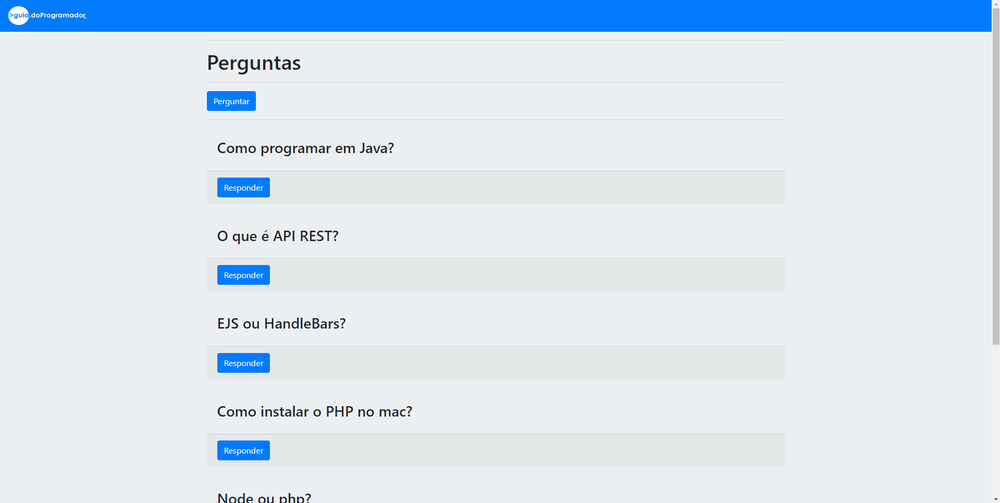
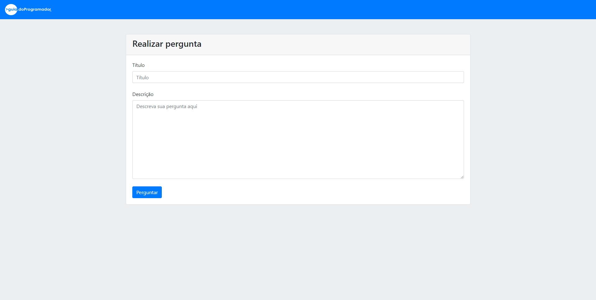
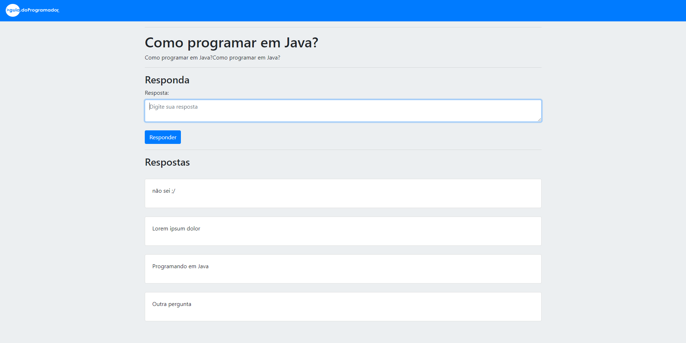
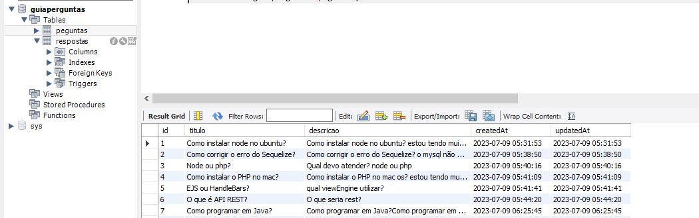

  

<h1 align="center">GuiaPerguntas</h1>

Plataforma de perguntas e respostas 

# Funcionalidades
- Fazer perguntas ✔️
- Responder perguntas ✔️
- Salvamento em banco de dados✔️
 

# Instalação 

- #### 🚀 git clone https://github.com/dudusanttos/plataforma-perguntas-e-respostas.git
- #### 🚀 npm install
- #### 🚀 nodemon index.js

## Mostre seu apoio!

Ajude o projeto com uma ⭐️ 

